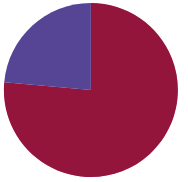
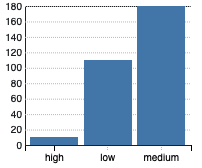
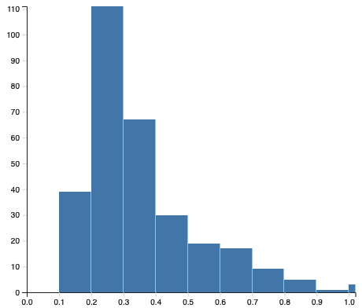
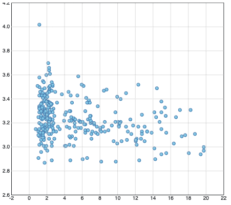
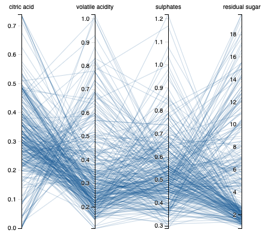
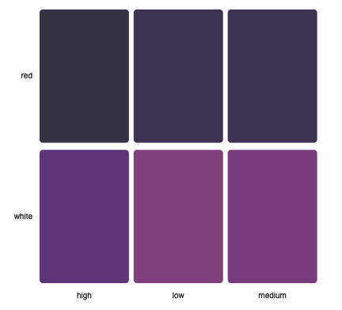
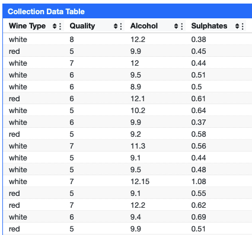

# Eaglescope

[<h2 align="center"></h2>](.eaglescope.png)

Eaglescope is a configurable code-free interactive visualization and cohort definition and analysis tool designed for biomedical data exploration. It is designed to be hosted flexibly without the need for a dedicated server, and creates an interactive dashboard based upon a configuration file and either an API or data file. It uses visualizations of sets of features to describe and enable contextual filtering of the data. This allows for users to understand deeper patterns or anomalies within the data, and to create datasets specifically tuned to their requirements effortlessly. Eaglescope is typically utilized either as a tool to create refined datasets tailored for training and validating machine learning AI models, or as a central hub for further exploration, allowing users to seamlessly navigate to biomedical viewers such as DICOM or whole slide imaging (WSI) platforms. 

## Development

Please see our [code of conduct](code_of_conduct.md) for the expectations for all open source community members.

Install dependencies by running `npm install`

Use develop mode by running `npm run dev`

Build ./dist for use with a static web server by running `npm run build`

To run code style checks, run `npm run lint` or to also try to automatically fix some issues, run `npm run lint:fix`.

To run unit and functional tests (also run automatically [using github actions](.github/workflows/smoke_test.yml), run `npm run test` which runs the tests in [this folder](./tests).

# Setup and Configuration

The simplest way to set up eaglescope is to build (`npm run build`) then host the contents of ./dist/ using a static web server such as rapache or `python -m http.server`. Additionally, configuration and data resources are already on the web with appropriate cross origin headers, you can simply navigate to [https://sharmalab.github.io/eaglescope/?configurl=](https://sharmalab.github.io/eaglescope/?configurl=)(configuration json file).

Each Eaglescope dashboard needs a configuration url which contains global information for the dashboard, information about the data resource and how to read it, and configuration for each visualization.

<table>
  <tr>
   <td><strong>CONFIGURATION FIELD</strong>
   </td>
   <td><strong>DESCRIPTION</strong>
   </td>
   <td><strong>EXAMPLE VALUE</strong>
   </td>
  </tr>
  <tr>
   <td>HOME_URL
   </td>
   <td>What url the “home” button directs to.
   </td>
   <td>"https://github.com/sharmalab/eaglescope/"
   </td>
  </tr>
  <tr>
   <td>TITLE
   </td>
   <td>The title in the header and browser tab for this dashboard.
   </td>
   <td>"Eaglescope Demo | Wines"
   </td>
  </tr>
  <tr>
   <td>UNIT_OF_GRID_VIEW
   </td>
   <td>The unit size in pixels for the x and y values for visualization size.
   </td>
   <td>[200,200]
   </td>
  </tr>
  <tr>
   <td>MARGIN_OF_GRID_VIEW
   </td>
   <td>The unit size in pixels for margins around visualizations.
   </td>
   <td>[10,10]
   </td>
  </tr>
  <tr>
   <td>HAS_SETTINGS
   </td>
   <td>Whether to render the settings button to modify the dashboard temporarily. 
   </td>
   <td>Any “truthy” value is true, otherwise do not include this field.
   </td>
  </tr>
  <tr>
   <td>RESIZABLE
   </td>
   <td>Whether to allow users to resize visualizations.
   </td>
   <td>Any “truthy” value is true, otherwise do not include this field.
   </td>
  </tr>
  <tr>
   <td>DRAGGABLE
   </td>
   <td>Whether to allow users to reorder and reposition visualizations.
   </td>
   <td>Any “truthy” value is true, otherwise do not include this field.
   </td>
  </tr>
  <tr>
   <td>DATA_RESOURCE_URL
   </td>
   <td>The url or path for the API or file for this dashboard’s data.
   </td>
   <td>“http://localhost:1234/config/wines.csv”
   </td>
  </tr>
  <tr>
   <td>DATA_FORMAT
   </td>
   <td>Which parsing method to use; can be ‘json’ or ‘csv’.
   </td>
   <td>“csv” or “json”
   </td>
  </tr>
</table>

Additionally, the field “VISUALIZATION_VIEW_CONFIGURATION” contains a list of visualization config, where each element in the list represents one visualization. Most visualizations support the following fields:

<table>
  <tr>
   <td><strong>CONFIGURATION FIELD</strong>
   </td>
   <td><strong>DESCRIPTION</strong>
   </td>
   <td><strong>EXAMPLE VALUE</strong>
   </td>
  </tr>
  <tr>
   <td>id
   </td>
   <td>Unique reference to each visualization
   </td>
   <td>“chart_4”
   </td>
  </tr>
  <tr>
   <td>title
   </td>
   <td>Rendered title
   </td>
   <td>"Volatile and Citric Acidity"
   </td>
  </tr>
  <tr>
   <td>description
   </td>
   <td>Comments for the chart
   </td>
   <td>“Compare these fields”
   </td>
  </tr>
  <tr>
   <td>chartType
   </td>
   <td>Which visualization to render.
   </td>
   <td>Must be an implemented chart type. See this link (<a href="https://github.com/sharmalab/eaglescope/blob/90d6dd1f6c9d0af3d27d740c1eb9e5011608ac1d/source/components/VisualTools/VisTypeComponents.js#L10">https://github.com/sharmalab/eaglescope/blob/90d6dd1f6c9d0af3d27d740c1eb9e5011608ac1d/source/components/VisualTools/VisTypeComponents.js#L10</a>)  for a list of chart types.
   </td>
  </tr>
  <tr>
   <td>fields
   </td>
   <td>Maps fields from their name in the data resource to the fields the chart uses, usually  \
“x”, “y”
   </td>
   <td>{ "x": "volatile acidity", "y": "citric acid" }
   </td>
  </tr>
  <tr>
   <td>size
   </td>
   <td>The size of the visualization in units of UNIT_OF_GRID_VIEW from the dashboard configuration.
   </td>
   <td>[2, 1]
   </td>
  </tr>
  <tr>
   <td>priority
   </td>
   <td>When rendering, how to order. Higher priority floats up.
   </td>
   <td>42
   </td>
  </tr>
</table>

## Visualization Types
<table style="width: 100%; min-width: 500px; border-collapse: collapse; overflow-x: auto; display: block;">
    <thead>
        <tr>
            <th style="width: 15%; padding: 8px; border: 1px solid #ddd; background-color: #f4f4f4;">Chart Type</th>
            <th style="width: 40%; padding: 8px; border: 1px solid #ddd; background-color: #f4f4f4;">Use for</th>
            <th style="width: 100px; padding: 8px; border: 1px solid #ddd; background-color: #f4f4f4;">Photo</th>
            <th style="width: 25%; padding: 8px; border: 1px solid #ddd; background-color: #f4f4f4;">Fields</th>
        </tr>
    </thead>
    <tbody>
        <tr>
            <td style="padding: 8px; border: 1px solid #ddd;"><strong>PIE_CHART</strong></td>
            <td style="padding: 8px; border: 1px solid #ddd;">Proportions for distinct values of x.</td>
            <td style="padding: 8px; border: 1px solid #ddd; text-align: center;"></td>
            <td style="padding: 8px; border: 1px solid #ddd;">x</td>
        </tr>
        <tr>
            <td style="padding: 8px; border: 1px solid #ddd;"><strong>BAR_CHART</strong></td>
            <td style="padding: 8px; border: 1px solid #ddd;">Total count of distinct values of x.</td>
            <td style="padding: 8px; border: 1px solid #ddd; text-align: center;"></td>
            <td style="padding: 8px; border: 1px solid #ddd;">x</td>
        </tr>
        <tr>
            <td style="padding: 8px; border: 1px solid #ddd;"><strong>HISTOGRAM</strong></td>
            <td style="padding: 8px; border: 1px solid #ddd;">Binned continuous values of x, with binsCount bins.</td>
            <td style="padding: 8px; border: 1px solid #ddd; text-align: center;"></td>
            <td style="padding: 8px; border: 1px solid #ddd;">x</td>
        </tr>
        <tr>
            <td style="padding: 8px; border: 1px solid #ddd;"><strong>SCATTER_CHART</strong></td>
            <td style="padding: 8px; border: 1px solid #ddd;">The relationship between two generally continuous variables.</td>
            <td style="padding: 8px; border: 1px solid #ddd; text-align: center;"></td>
            <td style="padding: 8px; border: 1px solid #ddd;">x and y for the spatial axes values</td>
        </tr>
        <tr>
            <td style="padding: 8px; border: 1px solid #ddd;"><strong>PARALLEL_COORDINATES</strong></td>
            <td style="padding: 8px; border: 1px solid #ddd;">Data points as lines going through a set of variables.</td>
            <td style="padding: 8px; border: 1px solid #ddd; text-align: center;"></td>
            <td style="padding: 8px; border: 1px solid #ddd;">y: an array of each field to render in order.</td>
        </tr>
        <tr>
            <td style="padding: 8px; border: 1px solid #ddd;"><strong>KM_CURVE</strong></td>
            <td style="padding: 8px; border: 1px solid #ddd;">Shows heatmap-like density in a 2D space of x, y.</td>
            <td style="padding: 8px; border: 1px solid #ddd;"></td>
            <td style="padding: 8px; border: 1px solid #ddd;">Event, time, and group as objects including field and title. Also, eventValue, and censoredValue.</td>
        </tr>
        <tr>
            <td style="padding: 8px; border: 1px solid #ddd;"><strong>DENSITY_2D</strong></td>
            <td style="padding: 8px; border: 1px solid #ddd;">Shows observation density in a 2D space of x, y.</td>
            <td style="padding: 8px; border: 1px solid #ddd; text-align: center;"></td>
            <td style="padding: 8px; border: 1px solid #ddd;">x and y for the spatial axes values</td>
        </tr>
        <tr>
            <td style="padding: 8px; border: 1px solid #ddd;"><strong>HEATMAP</strong></td>
            <td style="padding: 8px; border: 1px solid #ddd;">Uses color to show mean value of z for discrete-grouped observations by x and y.</td>
            <td style="padding: 8px; border: 1px solid #ddd; text-align: center;"></td>
            <td style="padding: 8px; border: 1px solid #ddd;">x and y for spatial arrangement of values, z for colors</td>
        </tr>
        <tr>
            <td style="padding: 8px; border: 1px solid #ddd;"><strong>HORIZONTAL_BAR_CHART</strong></td>
            <td style="padding: 8px; border: 1px solid #ddd;">A horizontal bar chart.</td>
            <td style="padding: 8px; border: 1px solid #ddd;"></td>
            <td style="padding: 8px; border: 1px solid #ddd;">x and y for the spatial axes values</td>
        </tr>
        <tr>
            <td style="padding: 8px; border: 1px solid #ddd;"><strong>VIS_DATA_TABLE</strong></td>
            <td style="padding: 8px; border: 1px solid #ddd;">A tabular representation of data for columns supplied.</td>
            <td style="padding: 8px; border: 1px solid #ddd; text-align: center;"></td>
            <td style="padding: 8px; border: 1px solid #ddd;">(list of objects representing fields to show in table)</td>
        </tr>
    </tbody>
</table>

## Interactive Demo Site
[Eaglescope Demo](https://sharmalab.github.io/eaglescope/)
