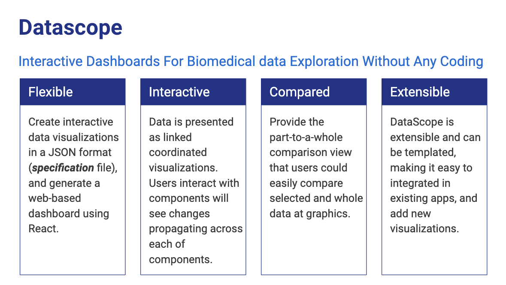
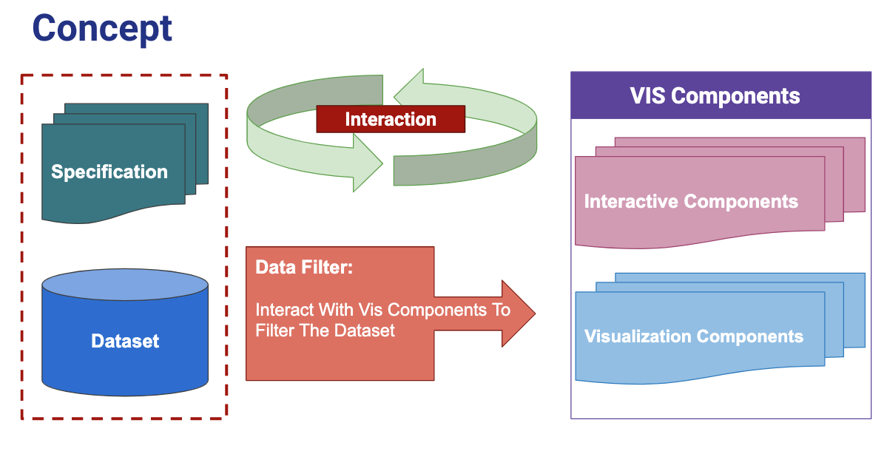

# DataScope 2
Cohort Visualization And Selection Dashboard For Biomedical Data Exploration Without Any Coding. 



## Development
Install dependencies using `npm install`

Develop mode using `npm run dev`


### Running ###


##### Prerequisites

* Install [Node.js](https://nodejs.org/en/download/) and [NPM](https://www.npmjs.com/get-npm)


##### Installation

* Clone the [repository](https://github.com/birm/datascope2.git)
* Enter the datascope2 directory (this directory)
* Get dependencies with ```npm install``
* Run ```npm run build```

##### Running
* Modify the files present in ```./config/vis-config.json``` to fit your needs:
    * UNIT_OF_GRID_VIEW                   (For basic unit in each viusal component)
    * MARGIN_OF_GRID_VIEW                 (For setting the margin unit in pixel) 
    * DATA_RESOURCE_URL                   (For data resource)
    * VISUALIZATION_VIEW_CONFIGURATION    (For dashboard settings)


* Run ```npm run dev```
* Goto ```http://localhost:1234``` from your favorite browser.

## Architecture


[OVERALL](https://docs.google.com/presentation/d/1zvXCeV-a8k4VercXsgFPTHqml7QwmDDu9snz6dhqIC4/edit?usp=sharing)

[DEMO VIDEO](https://youtu.be/8ce1-LKtsKs)
